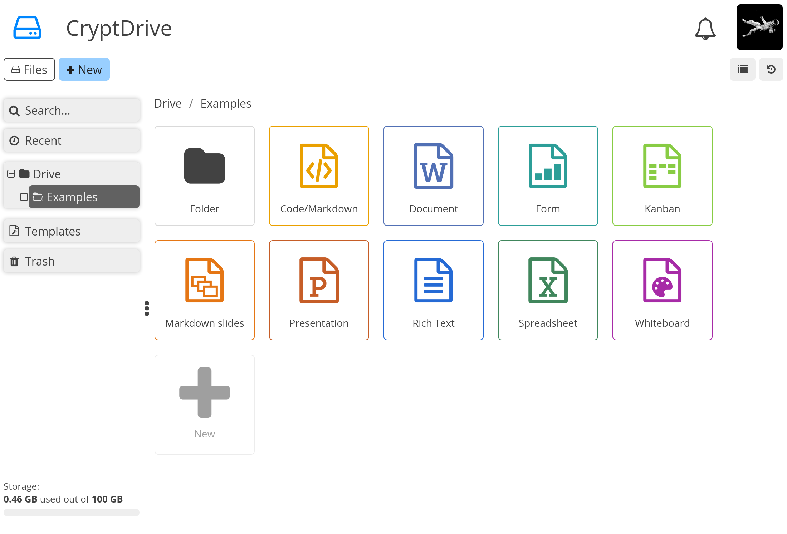
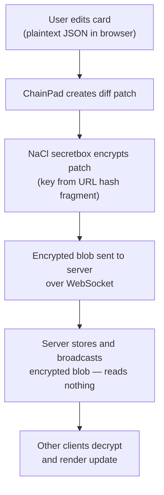
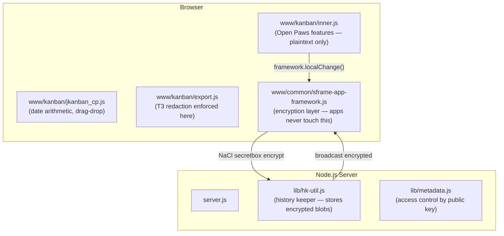

<!--
SPDX-FileCopyrightText: 2023 XWiki CryptPad Team <contact@cryptpad.org> and contributors
SPDX-FileCopyrightText: 2024 Open Paws contributors

SPDX-License-Identifier: AGPL-3.0-or-later
-->

# Open Paws Project Management

[](LICENSE)
[](scorecard.png)
[](package.json)
[](.nvmrc)
[](www/kanban/inner.js)
[](https://github.com/Open-Paws/cryptpad-project-management/commits/main)

End-to-end encrypted project management for animal advocacy organizations. This is a customized fork of [CryptPad](https://cryptpad.org) that extends the Kanban board with strategic campaign scoring, security-tiered access, task management, and three switchable views (Pipeline, My Tasks, Timeline). Built for [Open Paws](https://openpaws.ai) to coordinate advocacy work under hostile legal environments; suitable for any organization that needs encrypted, real-time collaborative project planning.

> [!NOTE]
> This project is part of the [Open Paws](https://openpaws.ai) ecosystem — AI infrastructure for the animal liberation movement. [Explore the full platform →](https://github.com/Open-Paws)
>
> Open Paws is a 501(c)(3) nonprofit building tools for organizations working to end animal exploitation. This tool stores Tier 3 data (investigation planning, witness coordination, legal defense notes) and operates under a zero-knowledge architecture — the server never has access to decryption keys.

---



---

## Quickstart

```bash
git clone https://github.com/Open-Paws/cryptpad-project-management.git
cd cryptpad-project-management
cp config/config.example.js config/config.js
# Edit config.js — set httpUnsafeDomain and httpSafeDomain at minimum
docker compose up -d
```

For local development without Docker:

```bash
npm install && npm run install:components
npm run dev
```

Requires Node.js 18+ (see `.nvmrc`). Two DNS A records pointing to your server are needed — one for the main application domain, one for the sandbox domain.

---

## Features

- **Three views** — Pipeline (kanban with drag-and-drop columns), My Tasks (personal dashboard across all projects), and Timeline (Gantt chart with draggable bars)
- **Ten-dimension strategic scoring** — each project card carries a composite score (0–10) across dimensions including scale, impact magnitude, longevity, coalition building, and build feasibility; drives filtering and sorting
- **Security tier filtering** — projects are tagged T1 (public campaign), T2 (internal strategy), or T3 (investigation/legal); T3 items are excluded from all exports independently enforced in both `export.js` and `inner.js`
- **Sub-tasks inside project cards** — checkbox completion, per-task assignees and due dates, progress indicator, dependency IDs across projects
- **Assignee and date management** — assign team members to projects and tasks, start and due dates with urgency indicators, DST-safe date arithmetic
- **Filter and sort controls** — filter by assignee, score range, due date preset, completion status, and security tier; sort by score, due date, title, or creation date
- **Zero-knowledge encryption** — all data encrypted in the browser before reaching the server using NaCl secretbox (XSalsa20-Poly1305); server stores only encrypted blobs it cannot read
- **Real-time multi-user collaboration** — ChainPad operational transformation for conflict-free concurrent editing
- **Docker deployment** — multistage Dockerfile, compose file, and NGINX config examples included
- **Upstream sync workflow** — all customizations confined to `www/kanban/`; upstream CryptPad code is unchanged, enabling clean merges

---

## Documentation

- [Architecture](docs/ARCHITECTURE.md) — full system architecture
- [Security decisions](SECURITY_DECISIONS.md) — settled constraints, encryption domain sovereignty
- [CLAUDE.md](CLAUDE.md) — Ten Commandments of CryptPad development (required reading before any code change)
- [Kanban-specific patterns](www/kanban/CLAUDE.md) — patterns specific to the Kanban application
- [NGINX config examples](docs/example.nginx.conf) — reverse proxy setup
- [Upstream CryptPad docs](https://docs.cryptpad.org/en/dev_guide/setup.html) — developer guide for local setup

---

<details>
<summary>Architecture</summary>

### Encryption data flow



The encryption key lives in the URL hash fragment. Browsers never send hash fragments to servers. Access control is cryptographic, not server-side: sharing a document means sharing its URL.

### Component layout



All Open Paws customizations are confined to `www/kanban/`. Upstream CryptPad code outside that directory is not modified, which keeps upstream merges tractable.

### What the server can and cannot see

| The server CAN see | The server CANNOT see |
|---|---|
| Channel IDs (32 hex characters) | Document content of any kind |
| Message timestamps and sizes | User display names in documents |
| Who is connected (by session ID, not identity) | Search queries or tags |
| Access-control metadata (owners as public keys) | File names (encrypted in drive metadata) |
| Metadata command signatures | Encryption keys |

### Security tiers

| Tier | Data type | Export behavior |
|------|-----------|-----------------|
| T1 | Public-facing campaign content | Included in exports |
| T2 | Internal strategy, coalition coordination | Included in exports |
| T3 | Investigation planning, witness coordination, legal defense notes | Stripped from all exports |

T3 redaction is enforced independently in both `www/kanban/export.js` (`redactT3Items()`) and `www/kanban/inner.js`. Neither path alone is a single point of failure.

### Strategic scoring dimensions

| Key | Dimension | What it measures |
|-----|-----------|-----------------|
| `scale_score` | Scale | Number of animals and advocates affected |
| `impact_magnitude_score` | Impact Magnitude | Depth of positive change |
| `longevity_score` | Longevity | Lasting value over time |
| `multiplication_score` | Multiplication | Enables additional impact |
| `foundation_score` | Foundation | Creates platform for future work |
| `agi_readiness_score` | Future-Readiness | Adapts to a changing landscape |
| `accessibility_score` | Accessibility | Easy for advocates to adopt |
| `coalition_building_score` | Coalition Building | Strengthens movement unity |
| `pillar_coverage_score` | Coverage | Impact across advocacy approaches |
| `build_feasibility_score` | Build Feasibility | Speed and ease of implementation |

The composite score (average of all ten dimensions) displays on cards and drives filtering and sorting.

</details>

---

## Code Quality


## Contributing

Read [CLAUDE.md](CLAUDE.md) before writing any code — it contains the Ten Commandments of CryptPad development that govern all changes to this codebase. Then read [www/kanban/CLAUDE.md](www/kanban/CLAUDE.md) for Kanban-specific patterns.

Key rules:
- Never bypass `framework.localChange()` — it is the only encrypted sync path
- Never add server-side content access of any kind
- Run `semgrep --config semgrep-no-animal-violence.yaml` on all code and documentation changes
- Run `desloppify scan --path .` (minimum score: 85)
- Security-sensitive changes (encryption, key derivation, access control) require review before merging

When syncing with upstream [cryptpad/cryptpad](https://github.com/cryptpad/cryptpad), verify that T3 redaction still functions and all three views render correctly after every merge.

Animal advocates with JavaScript experience are welcome to contribute — especially on view improvements, scoring UI, and upstream sync tooling.

---

## License

GNU Affero General Public License v3.0 or later. See [LICENSE](LICENSE).

Upstream CryptPad is developed by [XWiki SAS](https://www.xwiki.com). Open Paws customizations are copyright Open Paws contributors.

---

<!-- Metadata for ecosystem tooling
tech_stack: JavaScript, Node.js, Express, NaCl/TweetNaCl, ChainPad, Less, Docker
project_status: production
difficulty: advanced
skill_tags: encryption, real-time-collaboration, kanban, project-management, nodejs, security
related_repos: platform, gary, context
-->

---

[Donate](https://openpaws.ai/donate) · [Discord](https://discord.gg/openpaws) · [openpaws.ai](https://openpaws.ai) · [Volunteer](https://openpaws.ai/volunteer)
