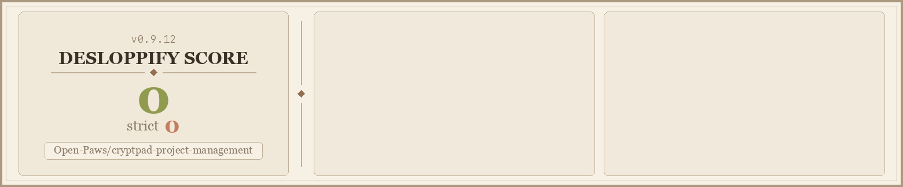

<!--
SPDX-FileCopyrightText: 2023 XWiki CryptPad Team <contact@cryptpad.org> and contributors

SPDX-License-Identifier: AGPL-3.0-or-later
-->

# Open Paws Project Management

[](scorecard.png)

> **Status: 🟢 Production** — Active operational tool for Open Paws. Do not add server-side content extraction features. See [Architecture Decisions](#architecture-decisions) for settled constraints.

**End-to-end encrypted project management for animal advocacy organizations with high security requirements.**

This is a customized fork of [CryptPad](https://cryptpad.org) that extends the Kanban board into a full-featured project management tool with strategic scoring, security-tiered access, dependency tracking, and multiple views. Built for [Open Paws](https://openpaws.ai) to coordinate advocacy work, but suitable for any organization that needs secure, collaborative project planning.

Part of the [Open Paws ecosystem](https://github.com/Open-Paws).

---

## Table of Contents

- [Why CryptPad](#why-cryptpad)
- [What This Fork Adds](#what-this-fork-adds)
- [Privacy and Security Model](#privacy-and-security-model)
- [Deployment](#deployment)
- [Configuration Reference](#configuration-reference)
- [Usage](#usage)
- [Syncing with Upstream CryptPad](#syncing-with-upstream-cryptpad)
- [Contributing](#contributing)
- [License](#license)

---

## Why CryptPad

CryptPad implements **zero-knowledge end-to-end encryption** using NaCl secretbox (XSalsa20-Poly1305). Encryption keys are derived from the URL hash fragment — a browser mechanism that is never sent to the server. This means:

- The server stores only encrypted blobs it cannot read
- There is no password or key to subpoena from the server operator
- Investigation planning notes, witness coordination, and legal defense drafts remain private even under hostile legal discovery
- Advocacy organizations can collaborate on sensitive campaign strategy without operational security risk

CryptPad is AGPL-licensed, audited open-source software maintained by XWiki SAS. Self-hosting removes any third-party data exposure. No other collaboration tool combines this privacy model with real-time multi-user editing.

---

## What This Fork Adds

All customizations are confined to `www/kanban/`. Upstream CryptPad code is unchanged.

### Three Views

**Pipeline** — Enhanced kanban board with drag-and-drop columns, strategic priority scores on each card, and a compact mode toggle for dense boards.

**My Tasks** — Personal dashboard showing all tasks assigned to you across every project. Check off tasks inline, filter by status or due date, edit without leaving the view.

**Timeline** — Gantt chart view. Drag projects to reschedule, resize bars to change duration. Tasks appear nested under their parent projects.

### Strategic Scoring System

Ten-dimension scoring system for campaign prioritization. Each dimension is scored 0–10; the composite score (average) displays on cards and drives filtering and sorting.

| Key | Dimension | What It Measures |
|-----|-----------|-----------------|
| `scale_score` | Scale | Number of animals and advocates affected |
| `impact_magnitude_score` | Impact Magnitude | Depth of positive change |
| `longevity_score` | Longevity | Lasting value over time |
| `multiplication_score` | Multiplication | Enables additional impact |
| `foundation_score` | Foundation | Creates platform for future work |
| `agi_readiness_score` | Future-Readiness | Adapts to a changing landscape |
| `accessibility_score` | Accessibility | Easy for advocates to adopt |
| `coalition_building_score` | Coalition Building | Strengthens movement unity |
| `pillar_coverage_score` | Coverage | Impact across advocacy approaches |
| `build_feasibility_score` | Build Feasibility | Speed and ease of implementation |

### Security Tier Filtering

Projects carry a `security_tier` field (`T1`, `T2`, or `T3`) aligned with the [Open Paws three-tier security model](SECURITY_DECISIONS.md):

| Tier | Data Type | Handling |
|------|-----------|----------|
| T1 | Public-facing campaign content | Visible by default; exportable |
| T2 | Internal strategy, coalition coordination | Visible by default; exportable |
| T3 | Investigation planning, witness coordination, legal defense notes | Filtered from default views; stripped from all exports |

T3 items are never included in CryptDrive bulk exports. The `export.js` file and `redactT3Items()` in `inner.js` both enforce this independently.

### Tasks Inside Projects

Each project card can contain sub-tasks:

- Checkbox completion tracking
- Per-task assignees and due dates
- Progress indicator on the card (e.g., "3/5 complete")
- Tasks inherit the project's due date when none is set
- Dependency IDs link tasks across projects

### Assignee and Date Management

- Assign team members to projects and individual tasks
- Start dates and due dates with urgency indicators
- DST-safe date arithmetic (`parseDateLocal` / `toDayNumber` in `jkanban_cp.js`)

### Filtering and Sorting

Filter by assignee, score range, due date preset, completion status, and security tier. Sort by score, due date, title, or creation date.

---

## Privacy and Security Model

### Zero-Knowledge Architecture

All data — scores, assignees, tasks, dates, notes — is encrypted in the browser before it reaches the server. The server stores encrypted blobs and cannot read any content.

```
User edits card (plaintext JSON in browser)
    ↓
ChainPad creates a diff patch
    ↓
NaCl secretbox encrypts the patch
    ↓
Encrypted blob transmitted to server
    ↓
Server stores and broadcasts the blob — reads nothing
    ↓
Other clients decrypt and render
```

The encryption key lives in the URL hash fragment. Browsers never send hash fragments to servers. Sharing a document means sharing its URL; access control is cryptographic, not server-side.

### What the Server Can and Cannot See

| The server CAN see | The server CANNOT see |
|---|---|
| Channel IDs (32 hex characters) | Document content of any kind |
| Message timestamps and sizes | User display names in documents |
| Who is connected (by session ID, not identity) | Search queries or tags |
| Access-control metadata (owners as public keys) | File names (encrypted in drive metadata) |
| Metadata command signatures | Encryption keys |

### Security Tiers and Legal Risk

This tool stores Tier 3 data (investigation planning, witness coordination, legal defense notes). The encryption architecture is the primary protection. No feature may add server-side content extraction. SSO integration requires `forceCpPassword: true` so that the server operator's SSO provider cannot derive encryption keys.

Full security analysis: [SECURITY_DECISIONS.md](SECURITY_DECISIONS.md)

### Settled Constraints (2026-03-28 Decisions)

- CryptPad remains sovereign in its encryption domain. No automated content extraction.
- CryptPad (NaCl secretbox) and Matrix (Megolm) are structurally incompatible. Content crossing between them must be a deliberate human action — no proxy re-encryption bridges.
- CryptPad keys must never appear in Matrix widget state events. Use the wrapper-page pattern with keys stored in encrypted timeline events.

---

## Deployment

### Requirements

CryptPad requires dedicated infrastructure and will not run correctly on PaaS platforms (Railway, Vercel, Heroku, Render) due to:

- Cross-origin iframe sandboxing requiring two separate domains
- Persistent WebSocket connections
- Complex Content Security Policy header configuration
- High file descriptor limits

**Minimum VPS spec:** 2 GB RAM, 2 CPU cores  
**Recommended stack:** Docker Compose + NGINX reverse proxy + Let's Encrypt SSL

### DNS Setup

You need two DNS A records pointing to your server:

```
cryptpaws.openpaws.ai   →  <your-server-ip>
cryptbox.openpaws.ai    →  <your-server-ip>
```

The main domain serves the application. The sandbox domain isolates untrusted content in a separate origin.

### Docker Compose Deployment

```bash
# Clone the repo
git clone https://github.com/Open-Paws/cryptpad-project-management.git
cd cryptpad-project-management

# Copy the example config
cp config/config.example.js config/config.js

# Edit config — set httpUnsafeDomain and httpSafeDomain at minimum
$EDITOR config/config.js

# Start the service
docker compose up -d

# Check health
docker compose ps
curl -f http://localhost:3002/
```

The `docker-compose.yml` maps:
- Port 3002 (host) → 3000 (container): main app
- Port 3001 (host) → 3001 (container): WebSocket
- Port 3005 (host) → 3003 (container): sandbox

Set up NGINX to proxy these ports to your two domains with SSL termination.

### Volumes

| Volume | Contents |
|--------|----------|
| `./data/blob` | Uploaded files (encrypted) |
| `./data/block` | User login blocks (encrypted) |
| `./customize` | Custom translations and branding |
| `./data/data` | Server state, session data |
| `./data/files` | Document datastore (encrypted) |
| `./config/config.js` | Server configuration (mounted read-only) |

Back up `./data/` regularly. The datastore contains all encrypted documents.

### Development Setup

Follow the upstream [CryptPad developer guide](https://docs.cryptpad.org/en/dev_guide/setup.html) to run a local instance without Docker. Node.js 18+ is required (see `.nvmrc`).

```bash
npm install
npm run install:components
npm run dev
```

---

## Configuration Reference

The primary configuration file is `config/config.js` (copied from `config/config.example.js`). Key settings:

| Setting | Description | Example |
|---------|-------------|---------|
| `httpUnsafeDomain` | Main application domain | `"https://cryptpaws.openpaws.ai"` |
| `httpSafeDomain` | Sandbox domain for untrusted content | `"https://cryptbox.openpaws.ai"` |
| `httpAddress` | Interface to bind (Docker: `0.0.0.0`) | `"0.0.0.0"` |
| `httpPort` | Application port | `3000` |
| `websocketPort` | WebSocket port | `3003` |
| `adminKeys` | Ed25519 public keys for admin panel | `["<key>"]` |
| `maxWorkers` | Worker thread count (defaults to CPU count - 1) | `4` |
| `storage` | Storage backend (`"file"` or database) | `"file"` |

SSO is configured separately in `config/sso.example.js`. If SSO is enabled, `forceCpPassword: true` is required to preserve zero-knowledge properties.

---

## Usage

1. Create a new Kanban board from the CryptPad drive
2. Add columns (e.g., Backlog, In Progress, Review, Done)
3. Create project cards in columns
4. Click a card to edit: add tasks, set scores, assign team members, set dates, choose security tier
5. Switch views using the toolbar: Pipeline / My Tasks / Timeline
6. Use filters and sort options to focus current work
7. Use score-based sorting to surface highest-priority campaigns

---

## Syncing with Upstream CryptPad

This fork tracks upstream [cryptpad/cryptpad](https://github.com/cryptpad/cryptpad). All Open Paws customizations live in `www/kanban/` — upstream changes to that directory require careful merge review.

```bash
# Add upstream remote (first time only)
git remote add upstream https://github.com/cryptpad/cryptpad.git

# Fetch upstream changes
git fetch upstream

# Review what changed in the kanban directory
git diff main upstream/main -- www/kanban/

# Merge upstream into a branch for review
git checkout -b upstream-sync
git merge upstream/main

# Resolve conflicts in www/kanban/ carefully
# Run the test suite and verify the three views still work
# Verify T3 redaction still functions in export
```

**High-risk files for upstream sync:**

| File | Risk |
|------|------|
| `www/kanban/inner.js` | All Open Paws features live here — merge conflicts are likely |
| `www/kanban/jkanban_cp.js` | Date arithmetic and drag-drop customizations |
| `www/kanban/export.js` | T3 redaction logic — must be verified after every sync |
| `lib/hk-util.js` | Server-side history keeper — do not change encryption handling |

After any upstream sync, verify:

- [ ] All three views (Pipeline, My Tasks, Timeline) render correctly
- [ ] Scoring dimensions display and save on cards
- [ ] T3 items do not appear in exports
- [ ] Real-time collaboration works between two browser sessions
- [ ] View-only links cannot write

---

## Code Quality



## Contributing

1. Read `CLAUDE.md` before writing any code — it contains the Ten Commandments of CryptPad development that are inviolable for this codebase
2. Read `www/kanban/CLAUDE.md` for Kanban-specific patterns
3. Never bypass `framework.localChange()` — it is the only encrypted sync path
4. Never add server-side content access of any kind
5. Run `semgrep --config semgrep-no-animal-violence.yaml` on all code and documentation changes
6. Run `desloppify scan --path .` (minimum score: 85)
7. Security-sensitive changes (encryption, key derivation, access control) require review before merging

Use movement terminology precisely. No speciesist idioms in code, comments, or commit messages.

---

## License

GNU Affero General Public License v3.0 or later. See [LICENSE](LICENSE).

Upstream CryptPad is developed by [XWiki SAS](https://www.xwiki.com). Open Paws customizations are copyright Open Paws contributors.
